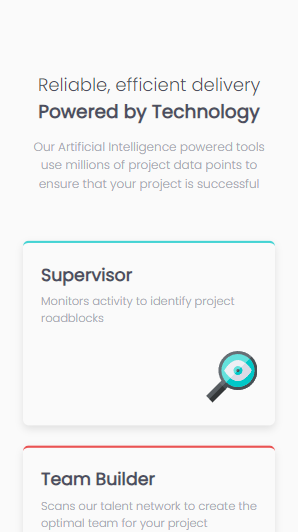

# Frontend Mentor - Four card feature section solution

This is a solution to the [Four card feature section challenge on Frontend Mentor](https://www.frontendmentor.io/challenges/four-card-feature-section-weK1eFYK). Frontend Mentor challenges help you improve your coding skills by building realistic projects. 

## Table of contents

- [Overview](#overview)
  - [The challenge](#the-challenge)
  - [Screenshot](#screenshot)
  - [Links](#links)
- [My process](#my-process)
  - [Built with](#built-with)
  - [What I learned](#what-i-learned)
- [Author](#author)

## Overview

### The challenge

Users should be able to:

- View the optimal layout for the site depending on their device's screen size

### Screenshot

Mobile

Desk

### Links

- Solution URL: [Frontend Mentor](https://www.frontendmentor.io/solutions/four-card-feature-section-html-and-sass-jxMlo4uWRS)
- Live Site URL: [GitHub Pages](https://oscarrodolfoumg.github.io/Challenge-Four-card-feature-section-FrontEnd-Mentor/)

## My process

### Built with

- Semantic HTML5 markup
- CSS custom properties
- Flexbox
- CSS Grid
- Mobile-first workflow
- SASS

### What I learned

First time using sass among many other functions that I can practice.

## Author

- Frontend Mentor - [@OscarRodolfoUMG](https://www.frontendmentor.io/profile/OscarRodolfoUMG)